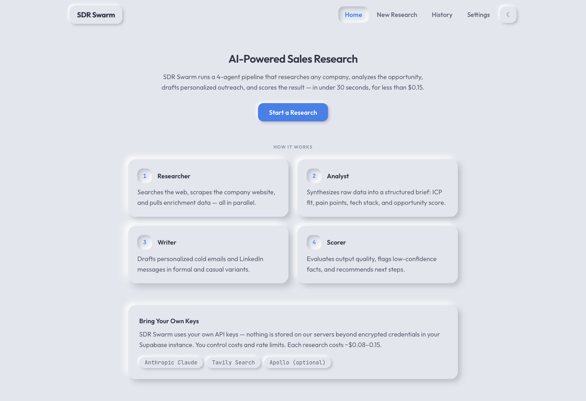
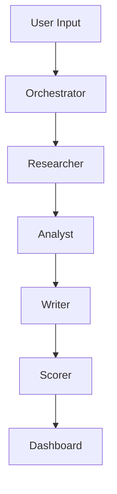
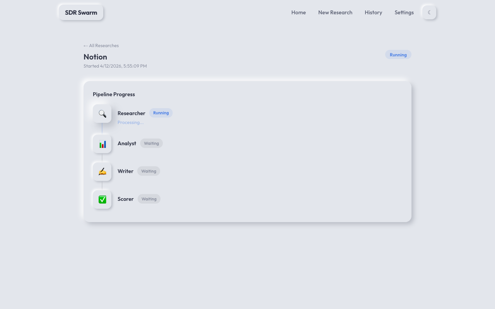
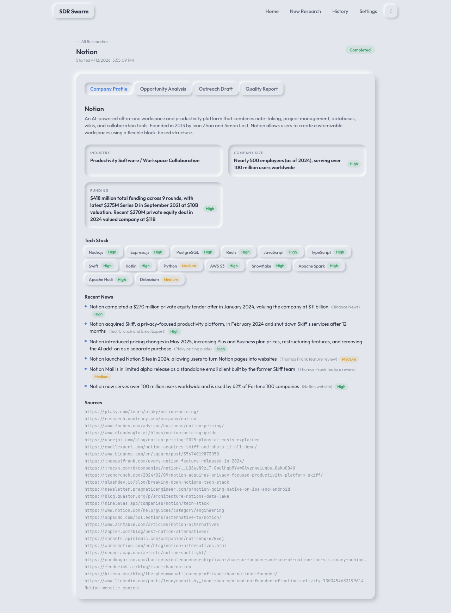
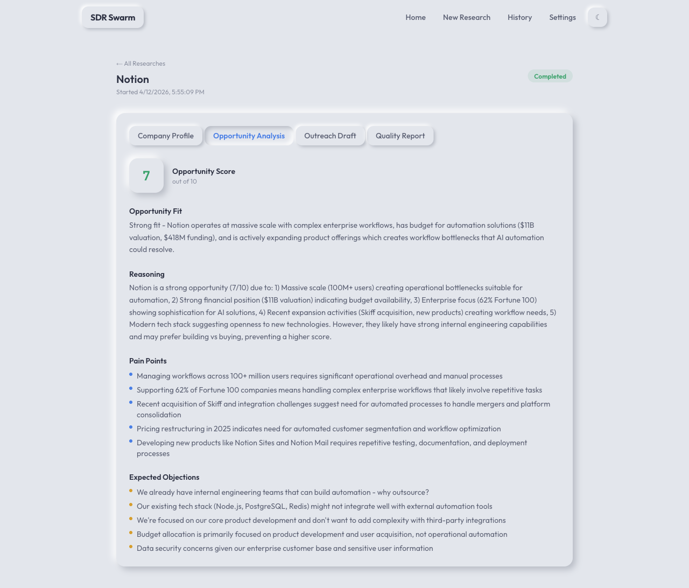
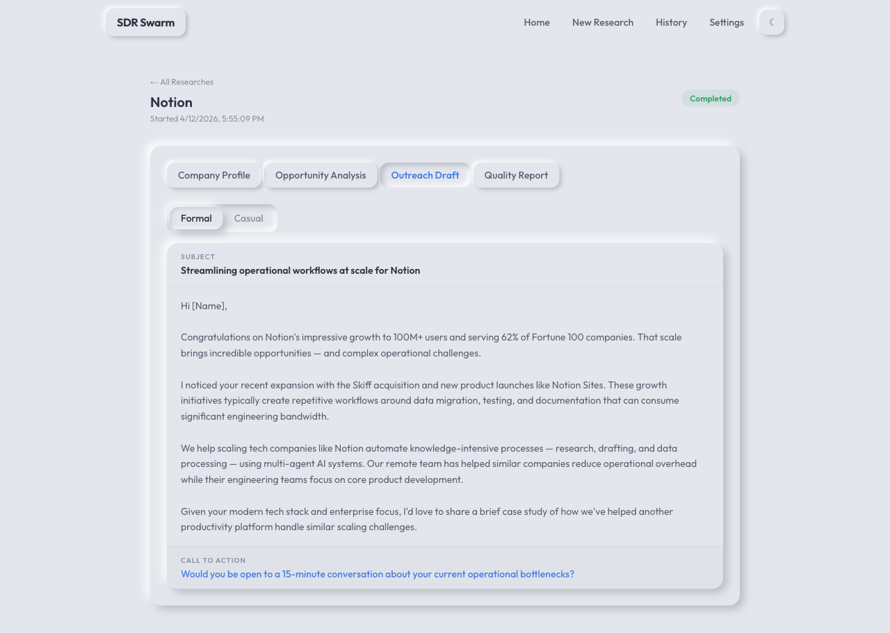
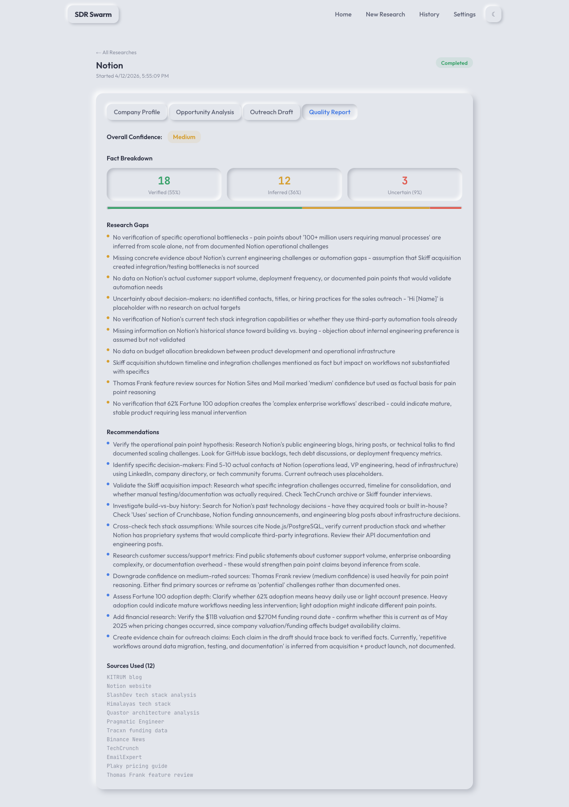
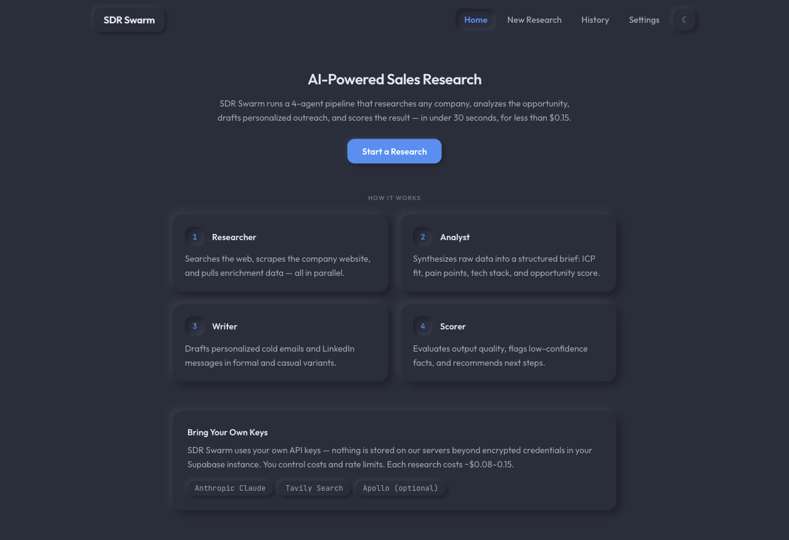
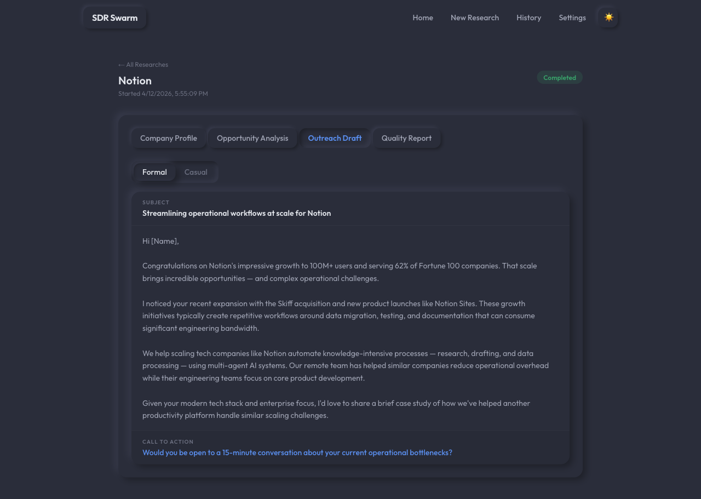

<p align="center">
  
</p>

<h1 align="center">SDR Swarm</h1>

<p align="center">
  4-agent pipeline that researches a company, analyzes the opportunity, drafts personalized outreach, and scores quality.<br/>
  <strong>~$0.12/run. Your keys. Your data.</strong>
</p>

<p align="center">
  <a href="#quick-start">Quick Start</a> &middot;
  <a href="#how-it-works">How It Works</a> &middot;
  <a href="#screenshots">Screenshots</a> &middot;
  <a href="#api-reference">API Reference</a> &middot;
  <a href="#contributing">Contributing</a>
</p>

<p align="center">
  
  
  
  
  <a href="https://github.com/martin-minghetti/sdr-swarm/actions"></a>
</p>

---

## The problem

B2B sales teams spend hours on manual prospecting: googling a company, reading their site, figuring out what they do, deciding if they're a good fit, then writing a cold email that doesn't sound like a template. Multiply that by 50 companies a week and you've got an SDR doing research instead of selling.

## The solution

SDR Swarm replaces that entire workflow with a single input: a company URL. Four AI agents run in sequence — research, analyze, write, score — and deliver a complete outreach package in 15-30 seconds for about **$0.08-0.15 per company**.

No fine-tuning, no training data, no vendor lock-in. You bring your own API keys, everything runs on your infrastructure, and the results stream to your dashboard in real time.

---

## How it works

A single company URL triggers a 4-agent sequential pipeline. Each agent builds on the previous output, streaming real-time progress to the dashboard via Server-Sent Events.



| Agent | What it does | Model |
|-------|-------------|-------|
| **Researcher** | Fetches company data from Tavily search, homepage scraping, and Apollo enrichment in parallel | Sonnet |
| **Analyst** | Synthesizes raw data into structured intelligence — ICP fit, pain points, tech stack | Sonnet |
| **Writer** | Drafts a personalized cold email and LinkedIn message based on the analysis | Sonnet |
| **Scorer** | Evaluates output quality and flags low-confidence results for human review | Haiku |

**Cost per research: ~$0.08-0.15** — Sonnet for the heavy lifting, Haiku for scoring.

### Design principles

- **Direct SDK, no frameworks.** The orchestrator is ~80 lines of Python using the Anthropic SDK directly. No LangGraph, no CrewAI. A sequential pipeline doesn't need abstraction layers. See [DECISIONS.md](DECISIONS.md) for the full rationale.
- **Parallel where it matters.** Agents run sequentially (each needs the previous output), but the Researcher fetches from Tavily, the homepage scraper, and Apollo simultaneously via `asyncio.gather`.
- **SSE over WebSockets.** Progress updates are unidirectional. SSE is the correct primitive — no library, automatic reconnects, standard HTTP.
- **BYOK.** Your keys, your costs, your rate limits. Nothing is proxied through a third-party server.

---

## Screenshots

### Pipeline Progress


### Company Profile


### Opportunity Analysis


### Outreach Draft


### Quality Report


### Dark Mode



---

## BYOK — Bring Your Own Keys

SDR Swarm uses your own API keys, stored encrypted in your Supabase instance. No keys are ever sent to any server other than the provider APIs directly. You control your costs and rate limits.

Required keys:
- **Anthropic** — Claude Sonnet + Haiku for agents
- **Tavily** — web search for company research
- **Apollo** *(optional)* — contact and company enrichment

Keys are entered in the Settings panel and stored encrypted in your database.

---

## Tech stack

| Layer | Technology |
|-------|-----------|
| Backend | FastAPI (Python 3.14) |
| Agents | Anthropic Claude via direct SDK |
| Search | Tavily API |
| Enrichment | Apollo API |
| Scraping | BeautifulSoup |
| Database | Supabase (PostgreSQL + JSONB) |
| Frontend | Next.js 16 (App Router) + Tailwind CSS 4 |
| UI | Neomorphic design with dark mode |
| Streaming | Server-Sent Events (SSE) |
| CI | GitHub Actions |
| Deployment | Railway (backend) + Vercel (frontend) |

---

## Quick start

### 1. Clone the repo

```bash
git clone https://github.com/martin-minghetti/sdr-swarm.git
cd sdr-swarm
```

### 2. Create a Supabase project and run the migration

1. Create a new project at [supabase.com](https://supabase.com)
2. Open the SQL editor and run the contents of `backend/migrations/001_initial_schema.sql`

### 3. Set up the backend

```bash
cd backend
cp .env.example .env
# Fill in your SUPABASE_URL, SUPABASE_KEY, and ENCRYPTION_KEY
pip install -r requirements.txt
uvicorn main:app --reload
```

Backend runs at `http://localhost:8000`.

### 4. Set up the frontend

```bash
cd frontend
cp .env.example .env.local
# Set NEXT_PUBLIC_API_URL=http://localhost:8000
npm install
npm run dev
```

Frontend runs at `http://localhost:3000`.

### 5. Add your API keys and run a research

1. Open `http://localhost:3000`
2. Go to **Settings** and enter your Anthropic and Tavily API keys
3. Click **New Research**, enter a company URL
4. Watch the 4-agent pipeline run in real time

---

## API reference

| Method | Endpoint | Description |
|--------|----------|-------------|
| `POST` | `/api/research` | Start a new research job |
| `GET` | `/api/research/{id}/stream` | SSE stream for real-time progress |
| `GET` | `/api/research/{id}` | Fetch completed research result |
| `GET` | `/api/history` | List recent research jobs |
| `POST` | `/api/settings` | Save encrypted API keys |
| `GET` | `/api/settings` | Get masked API keys |
| `POST` | `/api/settings/validate` | Validate stored keys |
| `GET` | `/health` | Health check |

---

## Project structure

```
sdr-swarm/
├── backend/
│   ├── agents/           # Researcher, Analyst, Writer, Scorer
│   ├── services/         # Tavily, Apollo, scraper integrations
│   ├── models/           # Pydantic request/response models
│   ├── migrations/       # Supabase SQL migrations
│   ├── tests/            # 65 tests (pytest)
│   ├── orchestrator.py   # Pipeline coordinator
│   ├── main.py           # FastAPI app + SSE endpoints
│   └── config.py         # Settings and env vars
├── frontend/
│   ├── app/              # Next.js App Router pages
│   ├── components/       # UI components (progress, results, settings)
│   └── lib/              # API client, SSE utilities
├── docs/
│   └── screenshots/      # UI screenshots
├── .github/
│   └── workflows/
│       └── test.yml      # CI: lint, type-check, test
├── DECISIONS.md          # Key architectural decisions with rationale
└── LICENSE
```

---

## Built with

- [Anthropic Claude](https://anthropic.com) — agent intelligence
- [Tavily](https://tavily.com) — real-time web search
- [Apollo.io](https://apollo.io) — B2B enrichment
- [Supabase](https://supabase.com) — database and auth
- [FastAPI](https://fastapi.tiangolo.com) — backend framework
- [Next.js](https://nextjs.org) — frontend framework

---

## Contributing

Contributions are welcome. If you want to help:

1. Fork the repo
2. Create a feature branch (`git checkout -b feature/your-feature`)
3. Make your changes and add tests
4. Run the test suite (`cd backend && pytest`)
5. Open a pull request

For bugs or feature requests, [open an issue](https://github.com/martin-minghetti/sdr-swarm/issues).

---

## Community

- [Issues](https://github.com/martin-minghetti/sdr-swarm/issues) — bug reports and feature requests
- [Discussions](https://github.com/martin-minghetti/sdr-swarm/discussions) — questions, ideas, show & tell

---

## License

MIT — see [LICENSE](LICENSE)
