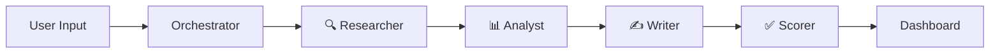

# SDR Swarm

SDR Swarm helps B2B teams research companies and draft personalized outreach without manual prospecting.


---

## How it works

SDR Swarm runs a 4-agent sequential pipeline triggered by a single company URL or domain. Each agent builds on the previous output, and the entire process streams real-time progress to the dashboard via Server-Sent Events.



| Agent | Role |
|-------|------|
| **Researcher** | Fetches company data from Tavily search, homepage scraping, and Apollo enrichment in parallel |
| **Analyst** | Synthesizes raw data into structured company intelligence (ICP fit, pain points, tech stack) |
| **Writer** | Drafts a personalized cold email and LinkedIn message based on the analysis |
| **Scorer** | Evaluates output quality and flags low-confidence results for human review |

**Cost per research: ~$0.08–0.15** (Sonnet for research/analysis/writing, Haiku for scoring)

---

## BYOK — Bring Your Own Keys

SDR Swarm uses your own API keys, stored locally in your browser. No keys are ever sent to any server other than the provider APIs directly. You control your costs and rate limits.

Required keys:
- **Anthropic** — Claude Sonnet + Haiku for agents
- **Tavily** — web search for company research
- **Apollo** *(optional)* — contact and company enrichment

Keys are entered in the Settings panel and stored encrypted in your Supabase instance.

---

## Tech stack

| Layer | Technology |
|-------|-----------|
| Backend | FastAPI (Python 3.12) |
| Agents | Anthropic Claude via direct SDK |
| Search | Tavily API |
| Enrichment | Apollo API |
| Scraping | BeautifulSoup |
| Database | Supabase (PostgreSQL + JSONB) |
| Frontend | Next.js (App Router) + Tailwind CSS |
| Streaming | Server-Sent Events (SSE) |
| CI | GitHub Actions |
| Deployment | Railway (backend) + Vercel (frontend) |

---

## Quick start

### 1. Clone the repo

```bash
git clone https://github.com/martin-minghetti/sdr-swarm.git
cd sdr-swarm
```

### 2. Create a Supabase project and run the migration

1. Create a new project at [supabase.com](https://supabase.com)
2. Open the SQL editor and run:

```bash
# Copy the contents of backend/migrations/001_initial_schema.sql
# and execute it in the Supabase SQL editor
```

### 3. Set up the backend

```bash
cd backend
cp .env.example .env
# Fill in your SUPABASE_URL, SUPABASE_SERVICE_KEY, and ENCRYPTION_KEY
pip install -r requirements.txt
uvicorn main:app --reload
```

Backend runs at `http://localhost:8000`.

### 4. Set up the frontend

```bash
cd frontend
cp .env.example .env.local
# Set NEXT_PUBLIC_API_URL=http://localhost:8000
npm install
npm run dev
```

Frontend runs at `http://localhost:3000`.

### 5. Add your API keys and run a research

1. Open `http://localhost:3000`
2. Go to **Settings** and enter your Anthropic and Tavily API keys
3. Enter a company URL or domain on the main screen
4. Watch the 4-agent pipeline run in real time

---

## API reference

| Method | Endpoint | Description |
|--------|----------|-------------|
| `POST` | `/research` | Start a new research job |
| `GET` | `/research/{id}/stream` | SSE stream for real-time progress |
| `GET` | `/research/{id}` | Fetch completed research result |
| `GET` | `/research` | List recent research jobs |
| `POST` | `/settings` | Save encrypted API keys |
| `GET` | `/health` | Health check |

---

## Project structure

```
sdr-swarm/
├── backend/
│   ├── agents/           # Researcher, Analyst, Writer, Scorer
│   ├── services/         # Tavily, Apollo, scraper integrations
│   ├── models/           # Pydantic request/response models
│   ├── migrations/       # Supabase SQL migrations
│   ├── tests/            # 65 tests (pytest)
│   ├── orchestrator.py   # Pipeline coordinator
│   ├── main.py           # FastAPI app + SSE endpoints
│   └── config.py         # Settings and env vars
├── frontend/
│   ├── app/              # Next.js App Router pages
│   ├── components/       # UI components (progress, results, settings)
│   └── lib/              # API client, SSE utilities
├── .github/
│   └── workflows/
│       └── test.yml      # CI: lint, type-check, test
├── DECISIONS.md          # Key architectural decisions with rationale
└── LICENSE
```

---

## Built with

- [Anthropic Claude](https://anthropic.com) — agent intelligence
- [Tavily](https://tavily.com) — real-time web search
- [Apollo.io](https://apollo.io) — B2B enrichment
- [Supabase](https://supabase.com) — database and auth
- [FastAPI](https://fastapi.tiangolo.com) — backend framework
- [Next.js](https://nextjs.org) — frontend framework

---

## License

MIT — see [LICENSE](LICENSE)
